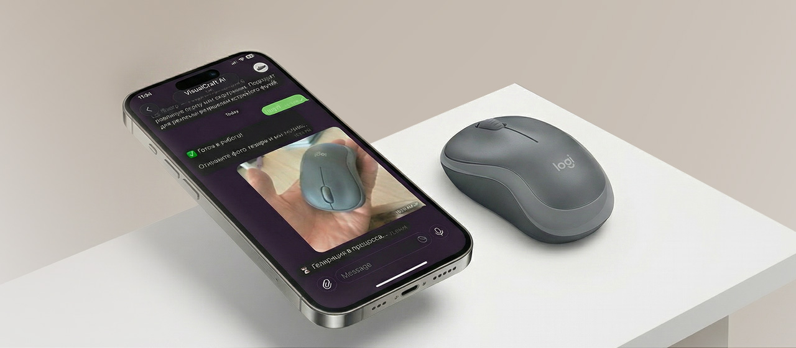
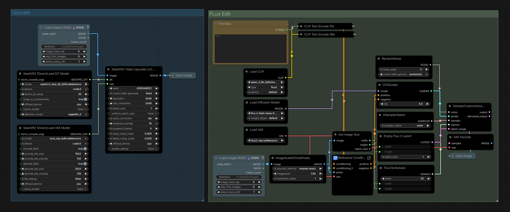
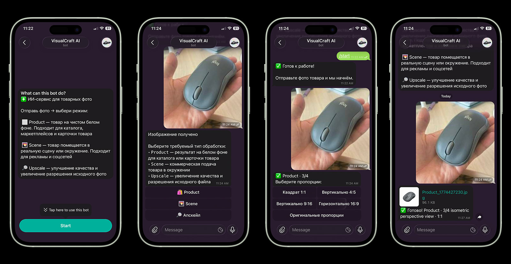
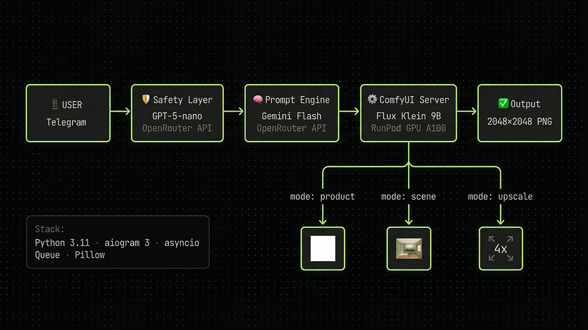

# Product Photo Bot

A Telegram bot that transforms raw product photos into ready-to-use commercial visuals using ComfyUI and Flux Klein 9B. No designers, no manual editing — just send a photo and get a result in under a minute.



---

## What it does

The bot accepts a product photo and runs it through a fully automated AI pipeline:

1. **Safety check** — `openai/gpt-5-nano` scans the image for NSFW / prohibited content
2. **Auto-upscale** — if the image resolution is too low, it gets upscaled automatically before processing
3. **Prompt generation** — `google/gemini-3-flash-preview` analyzes the product and writes a detailed Flux prompt
4. **Image generation** — ComfyUI runs the Flux Klein 9B workflow and returns the result



### Modes

| Mode | Description |
|------|-------------|
| `Product` | Clean white background, studio lighting — for marketplaces and catalogs |
| `Scene` | Product placed in a natural real-world environment — for ads and social media |
| `Upscale` | Increases resolution of the original photo without generation |



### Options

- **Aspect ratio**: 1:1 · 4:5 · 9:16 · 16:9 · Original
- **Camera angle**: Front · Side · Top-down · 3/4

### Output

Results are sent as a high-quality document file (JPEG, up to 2K resolution).

---

## Stack

- `Python 3.10+`
- `aiogram 3` — Telegram bot framework
- `ComfyUI` — local image generation server
- `Flux Klein 9B` — base generation model
- `OpenRouter API` — LLM routing (`openai/gpt-5-nano` + `google/gemini-3-flash-preview`)
- `Pillow` — image processing
- `asyncio Queue` — request queue for concurrent users
- `RunPod` — cloud GPU deployment



---

## Setup

### 1. Clone the repo

```bash
git clone https://github.com/solarwnd/telegram-ai-image-crafter.git
cd telegram-ai-image-crafter
```

### 2. Install dependencies

```bash
pip install -r requirements.txt
```

### 3. Configure environment

Copy `.env.example` to `.env` and fill in your values:

```bash
cp .env.example .env
```

```env
TELEGRAM_BOT_TOKEN=your_telegram_bot_token_here
OPENROUTER_API_KEY=your_openrouter_api_key_here
COMFYUI_SERVER_URL=https://YOUR_POD_ID-8188.proxy.runpod.net
```

### 4. Set up ComfyUI — Models

Download and place models into the correct folders inside `/workspace/ComfyUI/`:

#### `models/diffusion_models/`
```bash
wget -O flux-2-klein-9b.safetensors \
  "https://huggingface.co/black-forest-labs/FLUX.2-klein-9B/resolve/main/flux-2-klein-9b.safetensors?download=true"
```
→ [FLUX.2-klein-9B on HuggingFace](https://huggingface.co/black-forest-labs/FLUX.2-klein-9B/blob/main/flux-2-klein-9b.safetensors)

#### `models/vae/`
```bash
wget -O flux2-vae.safetensors \
  "https://huggingface.co/Comfy-Org/flux2-dev/resolve/main/split_files/vae/flux2-vae.safetensors?download=true"
```
→ [flux2-vae on HuggingFace](https://huggingface.co/Comfy-Org/flux2-dev/blob/main/split_files/vae/flux2-vae.safetensors)

#### `models/SEEDVR2/`
```bash
wget -O seedvr2_ema_3b_fp16.safetensors \
  "https://huggingface.co/numz/SeedVR2_comfyUI/resolve/main/seedvr2_ema_3b_fp16.safetensors?download=true"

wget -O ema_vae_fp16.safetensors \
  "https://huggingface.co/numz/SeedVR2_comfyUI/resolve/main/ema_vae_fp16.safetensors?download=true"
```
→ [SeedVR2 models on HuggingFace](https://huggingface.co/numz/SeedVR2_comfyUI)

---

### 5. Set up ComfyUI — Custom Nodes

Install via ComfyUI Manager or clone manually into `ComfyUI/custom_nodes/`:

| Node | Used for | Link |
|------|----------|------|
| **ComfyUI-SeedVR2** | Upscaling workflow | [github.com/numz/ComfyUI-SeedVR2](https://github.com/numz/ComfyUI-SeedVR2) |
| **ComfyUI-VideoHelperSuite (VHS)** | Load image by path | [github.com/Kosinkadink/ComfyUI-VideoHelperSuite](https://github.com/Kosinkadink/ComfyUI-VideoHelperSuite) |

```bash
cd /workspace/ComfyUI/custom_nodes

git clone https://github.com/numz/ComfyUI-SeedVR2
git clone https://github.com/Kosinkadink/ComfyUI-VideoHelperSuite
```

### 5. Run the bot

```bash
python bot.py
```

---

## Deployment on RunPod

### 1. Create a Pod

- Go to [runpod.io](https://runpod.io) → **Deploy**
- Template: **RunPod Fast Stable Diffusion** (has ComfyUI pre-installed)
- GPU: RTX 4090 or A100 recommended
- Expose port `8188` (HTTP)

### 2. Download the Flux Klein 9B model

Open the RunPod terminal and run:

```bash
cd /workspace/ComfyUI/models/diffusion_models

wget --header="Authorization: Bearer YOUR_HF_TOKEN" \
  -O flux-2-klein-base-9b-fp8.safetensors \
  "https://huggingface.co/black-forest-labs/FLUX.2-klein-base-9b-fp8/resolve/main/flux-2-klein-base-9b-fp8.safetensors?download=true"
```

### 3. Upload bot files

Upload the contents of this repo to `/workspace/bot/` (via RunPod file browser or `scp`).

### 4. Install dependencies

```bash
cd /workspace/bot
pip install -r requirements.txt
```

### 5. Configure environment

```bash
cp .env.example .env
nano .env
```

Fill in your tokens and set the ComfyUI URL:

```env
TELEGRAM_BOT_TOKEN=your_telegram_bot_token_here
OPENROUTER_API_KEY=your_openrouter_api_key_here
COMFYUI_SERVER_URL=https://YOUR_POD_ID-8188.proxy.runpod.net
```

> Get your pod URL from RunPod dashboard → **Connect** → **HTTP Service → port 8188**

### 6. Start ComfyUI

```bash
cd /workspace/ComfyUI
python main.py --listen 0.0.0.0 --port 8188 &
```

### 7. Run the bot

Use `tmux` so it keeps running after you close the terminal:

```bash
tmux new -s bot
cd /workspace/bot
python bot.py
```

Detach from tmux: `Ctrl+B`, then `D`. Reattach: `tmux attach -t bot`.

---

## Results


